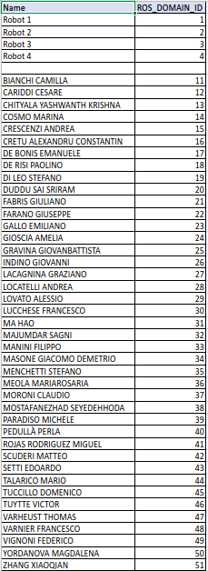

# drims_summerschool
These are the main repository for the DRIMS Summer School:
 - [drims_cells](https://github.com/CNR-STIIMA-IRAS/drims_cells): Contains robot descriptions, controllers, and launch files for setting up simulations and/or establishing communication with real robots.
 - [easy_motion](https://github.com/CNR-STIIMA-IRAS/easy_motion): Provides APIs, ROS actions, and Behavior Tree nodes for basic robot movements.
 - [drims_dice_simulator](https://github.com/CNR-STIIMA-IRAS/drims_dice_simulator): Offers a simulator for a dice.

For usage instructions and setup details, please refer to each package’s README.

## Docker
To start the docker

```bash
./start.sh <YOUR-ASSIGNED-ID>
```

where `<YOUR-ASSIGNED-ID>` can be found below.



to open a new terminal

```bash
./connect.sh
```
(this will read the ID that you gave to the last start.sh)

## CAMERA

To launch the camera:

```bash
ros2 launch depthai_ros_driver camera.launch.py namespace:=camera
```
